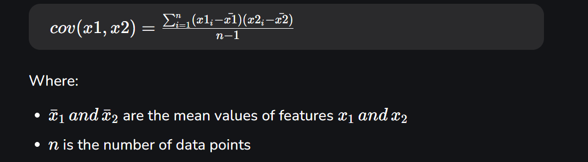

# Dimensionality-Reduction
## Principal component analysis
It help reduce the number of features in datasets while keeping important ones

How it works:
1. Standardize Data
2. Calculate Coverance 
i,e consider the two features ; x1, x2

3. Find Principal Components
 > 1st Principal Component (PC1): The direction of maximum variance (most spread).
 > 2nd Principal Component (PC2): The next best direction, perpendicular to PC1 and so on.

# AX = LX
 When A acts on X it only stretches or shrinks X by the scalar L.
The direction of X remains unchanged hence eigenvectors define "stable directions" of A.

4. Pick The Top direction and Transform data
After calculating the eigenvalues and eigenvectors PCA ranks them by the amount of information they capture. We then:

Select the top k components that capture most of the variance like 95%.
Transform the original dataset by projecting it onto these top components.

